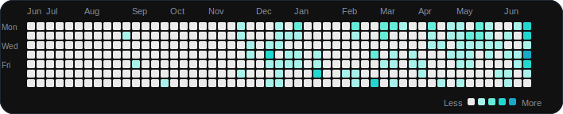

  

  Simple words, clear layout, and careful builds.

  
  
  
  

  

    <h1 style="margin: 0; color: #E94B78; font-family: 'Cormorant Garamond', Georgia, serif; font-size: 58px; font-weight: 700; letter-spacing: 0.8px;">
      Muhammed Sahal
    </h1>
    

    

      Full stack developer and dashboard builder
    

    

      Simple web apps, dashboards, and AI features
    

  

  

  Available for focused work

  <h2 style="margin: 0 0 10px 0; color: #E94B78; font-family: 'Playfair Display', Georgia, serif; font-size: 30px; font-weight: 700; letter-spacing: 0.2px;">
    About
  </h2>
  

  

    I build websites and dashboards that are easy to use.
    I care about clear layouts, fast loading, and code that is easy to keep up with.
    I also build AI features when they help the product.
  

  

    Web pages
    Dashboards
    AI features
  

 

  

<h2 align="center" style="color: #FFD166; font-family: 'Playfair Display', Georgia, serif; font-size: 30px; letter-spacing: 0.3px; margin-bottom: 6px;">
  Quick Facts
</h2>
  
A small set of notes about how I like to work.

<table width="100%" cellspacing="0" cellpadding="10" style="border-collapse: collapse; border: none;">
  <tr>
    <td width="25%" align="center">
      

        
STATUS

        
Online

      

    </td>
    <td width="25%" align="center">
      

        
FOCUS

        
Web pages

      

    </td>
    <td width="25%" align="center">
      

        
MODE

        
Build and design

      

    </td>
    <td width="25%" align="center">
      

        
STYLE

        
Clear layouts

      

    </td>
  </tr>
</table>

 

<h2 align="center" style="color: #14D7A0; font-family: 'Playfair Display', Georgia, serif; font-size: 30px; letter-spacing: 0.3px; margin-bottom: 6px;">
  Tools
</h2>

Shown as simple rows instead of big blocks.

<table width="100%" cellspacing="0" cellpadding="12" style="border-collapse: collapse; border: none;">
  <tr>
    <td valign="top">
      

        
FRONTEND

        
I build the parts people see and click.

        

          
        

      

    </td>
  </tr>
  <tr>
    <td valign="top">
      

        
BACKEND

        
I build the server side and data handling.

        

          
        

      

    </td>
  </tr>
  <tr>
    <td valign="top">
      

        
AI TOOLS

        
I use AI tools when they save time or help users.

        

          
          
          
        

      

    </td>
  </tr>
  <tr>
    <td valign="top">
      

        
DEPLOYMENT

        
I care about security, speed, and stable releases.

        

          
          
          
        

      

    </td>
  </tr>
  <tr>
    <td valign="top">
      

        
DAILY TOOLS

        
These are the tools I use most while building and testing.

        

          
        

      

    </td>
  </tr>
</table>

 

<h2 align="center" style="color: #1F8FB3; font-family: 'Playfair Display', Georgia, serif; font-size: 30px; letter-spacing: 0.3px; margin-bottom: 6px;">
  Quick Notes
</h2>

A few simple notes about how I work.

<table width="100%" cellspacing="0" cellpadding="0" style="border-collapse: collapse; border: none;">
  <tr>
    <td>
      

        <table width="100%" cellspacing="0" cellpadding="0" style="border-collapse: collapse; border: none;">
          <tr>
            <td width="33%" align="center" valign="top" style="padding: 6px 10px;">
              
MODE

              
Design + Build

              
Clear pages, small details, and good structure

            </td>
            <td width="34%" align="center" valign="top" style="padding: 6px 10px; border-left: 1px solid #334155; border-right: 1px solid #334155;">
              

                
                GITHUB ACTIVITY
              

              
Real contributions below

              
The chart underneath shows the actual activity

            </td>
            <td width="33%" align="center" valign="top" style="padding: 6px 10px;">
              
STYLE

              
Good contrast

              
Easy to scan, easy to use

            </td>
          </tr>
        </table>
      

    </td>
  </tr>
</table>

 

  

 

<h2 align="center" style="color: #1F8FB3; font-family: 'Playfair Display', Georgia, serif; font-size: 30px; letter-spacing: 0.3px; margin-bottom: 6px;">
  Projects
</h2>

A few examples of the kind of work I do.

  <h3 style="color: #F8FAFC; margin-bottom: 10px; font-family: 'Playfair Display', Georgia, serif; font-size: 24px; font-weight: 700;">01. AI Portfolio and Chat UI</h3>
  
A portfolio site with motion and a chat-like experience.

  <ul style="color: #E2E8F0; line-height: 1.8; padding-left: 20px;">
    <li>Motion and interactive visuals</li>
    <li>Live AI responses</li>
    <li>Login and protected pages</li>
  </ul>

 

  <h3 style="color: #F8FAFC; margin-bottom: 10px; font-family: 'Playfair Display', Georgia, serif; font-size: 24px; font-weight: 700;">02. ZodVault</h3>
  
A secure app for storing and managing data.

  <ul style="color: #E2E8F0; line-height: 1.8; padding-left: 20px;">
    <li>Encrypted storage</li>
    <li>Login and security checks</li>
    <li>Built with Next.js</li>
  </ul>

 

  <h3 style="color: #F8FAFC; margin-bottom: 10px; font-family: 'Playfair Display', Georgia, serif; font-size: 24px; font-weight: 700;">03. AutoLink Connect</h3>
  
An app that lets people connect quickly with QR codes.

  <ul style="color: #E2E8F0; line-height: 1.8; padding-left: 20px;">
    <li>Live messaging</li>
    <li>Server-side permissions</li>
    <li>Works on mobile</li>
  </ul>

 

  <h3 style="color: #F8FAFC; margin-bottom: 10px; font-family: 'Playfair Display', Georgia, serif; font-size: 24px; font-weight: 700;">04. Department Portal</h3>
  
A dashboard for managing department content.

  <ul style="color: #E2E8F0; line-height: 1.8; padding-left: 20px;">
    <li>Role-based access</li>
    <li>Fast loading</li>
    <li>Built with React and Vite</li>
  </ul>

 

<h2 align="center" style="color: #E94B78; font-family: 'Playfair Display', Georgia, serif; font-size: 30px; letter-spacing: 0.3px; margin-bottom: 6px;">
  How I Work
</h2>

A simple four-step process.

<table width="100%" cellspacing="0" cellpadding="0" style="border-collapse: collapse; border: none;">
  <tr>
    <td width="25%" align="center" style="padding: 10px;">
      

        
1

        <h4 style="color: #F8FAFC; margin: 0 0 8px 0; font-family: 'Playfair Display', Georgia, serif; font-size: 18px; font-weight: 700;">Listen</h4>
        
Learn what the project needs.

      

    </td>
    <td width="25%" align="center" style="padding: 10px;">
      

        
2

        <h4 style="color: #F8FAFC; margin: 0 0 8px 0; font-family: 'Playfair Display', Georgia, serif; font-size: 18px; font-weight: 700;">Plan</h4>
        
Decide the layout and flow.

      

    </td>
    <td width="25%" align="center" style="padding: 10px;">
      

        
3

        <h4 style="color: #F8FAFC; margin: 0 0 8px 0; font-family: 'Playfair Display', Georgia, serif; font-size: 18px; font-weight: 700;">Build</h4>
        
Write the code and fix the details.

      

    </td>
    <td width="25%" align="center" style="padding: 10px;">
      

        
4

        <h4 style="color: #F8FAFC; margin: 0 0 8px 0; font-family: 'Playfair Display', Georgia, serif; font-size: 18px; font-weight: 700;">Ship</h4>
        
Get it live and keep improving it.

      

    </td>
  </tr>
</table>

 

  
How I Like To Build

  

    <ul style="color: #E2E8F0; line-height: 1.9; padding-left: 20px;">
      <li>I like pages that are easy to scan.</li>
      <li>I use motion when it helps the page feel clear and alive.</li>
      <li>I care about code that is easy to understand and keep working on.</li>
    </ul>
  

 

<h2 align="center" style="color: #FFD166; font-family: 'Playfair Display', Georgia, serif; font-size: 30px; letter-spacing: 0.3px; margin-bottom: 6px;">
  Contact
</h2>

Open to web projects, dashboards, and AI features.

  
  

  Built with care

  
   
  

